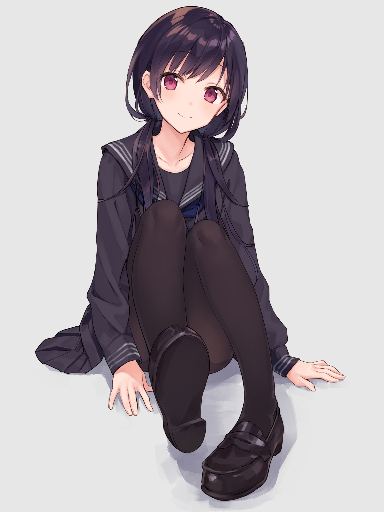
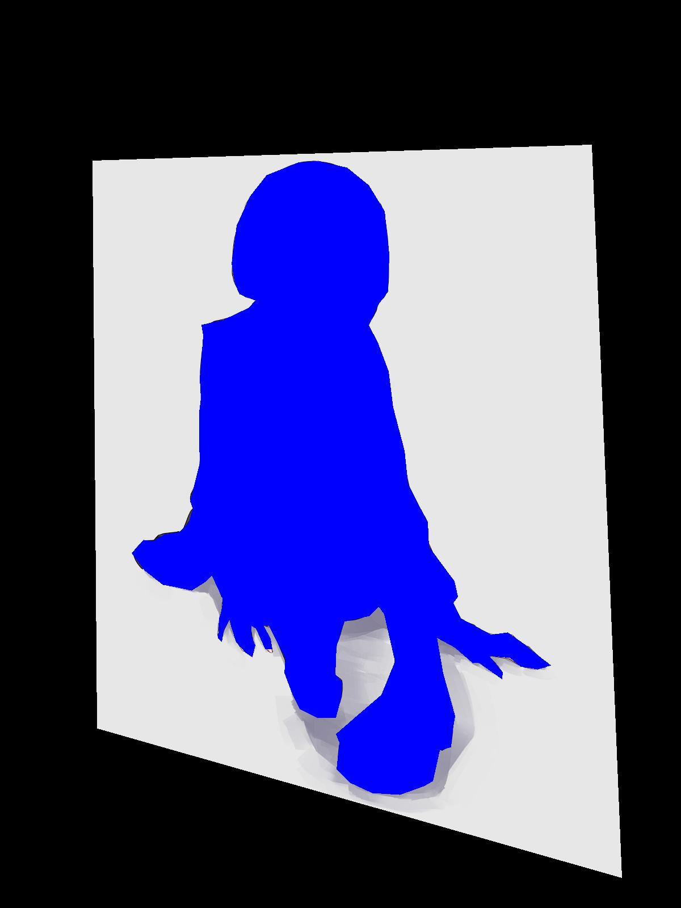

# perspective

## before

## after

## references
- https://pillow.readthedocs.io/en/stable/reference/Image.html#PIL.Image.Image.transform
- https://docs.opencv.org/master/da/d54/group__imgproc__transform.html
- https://github.com/pytorch/vision/pull/781/files
